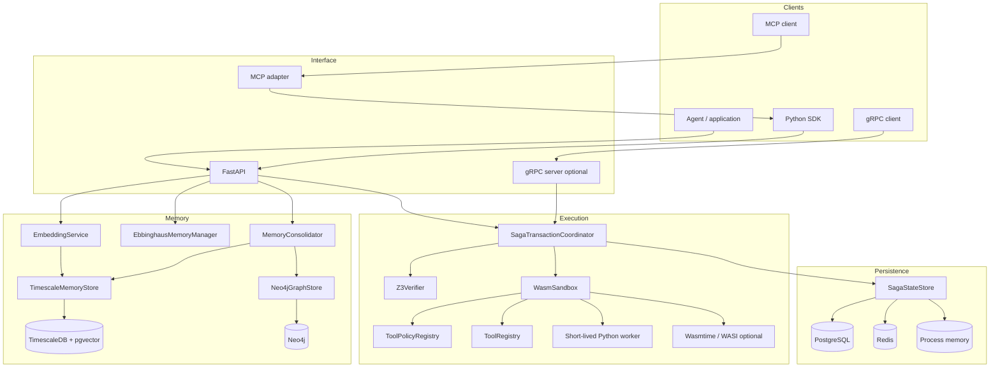

# System architecture

## Architectural style

SagaMind is a modular monolith by default. The REST process constructs service singletons at import time and coordinates them in one Python process. Durable stores and tool effects may be external, while optional gRPC and Temporal entry points provide alternative process boundaries.

The design has four planes:

1. **Interface plane:** REST, Python SDK, MCP, gRPC.
2. **Execution-control plane:** coordinator, verifier, policy registry, tool registry, approval gate, state store.
3. **Memory plane:** embeddings, episodic store, decay filtering, consolidation, semantic graph.
4. **Operations plane:** configuration, authentication, rate limiting, logs, metrics, deployment, migrations, experiments.

## Component view



## Execution-domain objects

The canonical internal models are dataclasses in `src/models.py`.

### `ActionPayload`

A tool name plus a dictionary of arguments. It is intentionally small; authorization and validation live outside the payload.

### `SagaStep`

One forward action and one compensation. It also carries:

- `step_id`: unique journal identity;
- `step_name`: operator-facing label;
- `invariants`: SMT-LIB2 text checked before execution;
- `idempotency_key`: optional deduplication key scoped to a Saga;
- approval flags;
- transient status and error fields.

### `SagaTransaction`

The in-process aggregate for one goal. It owns completed and pending steps. The durable store records status and effects, but the REST status endpoint reads this in-memory aggregate; after process restart, old Saga aggregates are not reconstructed into `active_sagas`.

### `SandboxResult`

The executor result envelope: `success`, `status`, structured `data`, and optional `error`.

## Persistence topology

`SagaStateStore` independently chooses a Saga-state backend:

```text
forced STATE_STORE_BACKEND
  ├─ postgres → must connect or fail
  ├─ redis    → must connect or fail
  └─ memory   → no durability

automatic selection
  PostgreSQL → Redis → memory
  (unless REQUIRE_BACKENDS=true, then absence is fatal)
```

PostgreSQL stores transaction state, effects, compensations, idempotency keys, dead letters, and history. Redis provides analogous structures. The memory implementation is deterministic and useful for tests, but all data disappears on restart.

Memory storage is separate. `TimescaleMemoryStore` uses PostgreSQL/TimescaleDB plus pgvector when available, otherwise a process-local list. `Neo4jGraphStore` uses Neo4j when available, otherwise process-local nodes and relationships.

## Startup and shutdown

Importing `src.main` constructs the verifier, sandbox, stores, coordinator, memory services, and speculative orchestrator. During FastAPI lifespan startup:

1. incomplete durable Sagas are scanned and recovery is attempted;
2. the optional consolidation scheduler is started if installed and configured.

On shutdown, the scheduler, Neo4j driver, and Saga store are closed. The Timescale connection pool currently has no explicit shutdown call in the lifespan.

## Tenant boundary

API keys can be unbound (`key`) or tenant-bound (`key:tenant_id`). The REST layer checks tenant access on Saga and memory routes. Tenant identity is stored with Saga metadata and episodic memories.

Important boundaries:

- `/saga/dead-letters` is protected but not filtered by tenant;
- speculative requests have no tenant field;
- the gRPC server does not implement API-key or tenant-boundary middleware;
- in-process Python callers can bypass REST authorization entirely.

## Control flow and data flow are different

The coordinator controls execution. The journal records recovery facts. The history table records completed forward steps for inspection. These are separate concerns:

- **journal:** authoritative lifecycle for recovery;
- **idempotency table/set:** whether a key was committed;
- **history:** replay/debug view of successful forward records;
- **in-memory aggregate:** current REST-visible Saga status and pending approval data.

Likewise, episodic memory and semantic graph data are separate:

- the episodic store is the evidence layer;
- graph edges are derived summaries;
- graph relationships do not replace or delete the source episodes.

## Optional distributed path

`src/orchestrator/temporal_worker.py` wraps a whole Saga execution in one Temporal activity. It is disabled unless `temporalio` and `TEMPORAL_TARGET` are configured. The REST API does not dispatch to it automatically. It should be understood as an optional integration skeleton, not the default coordinator architecture.

