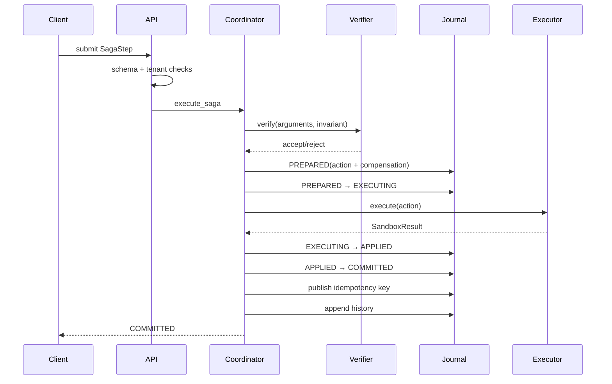

# Saga execution, compensation, and crash recovery

## Why the Saga pattern is used

A Saga represents one business goal as ordered local steps. Each step has a forward action and an explicit compensation. SagaMind runs forward steps in order and compensations in last-in-first-out order.

Example:

| Forward action | Possible compensation |
| --- | --- |
| Create a file | Delete the file |
| Reserve inventory | Release the reservation |
| Add a row | Delete or mark the row cancelled |

The compensation must be domain-correct. `DELETE_FILE` can undo creation of a previously absent file, but it cannot restore content overwritten by `WRITE_FILE`. The protocol cannot infer that distinction.

## Normal step lifecycle

The critical rule is that `PREPARED` contains both the forward action and compensation before execution begins.

## Saga-level states

| State | Meaning |
| --- | --- |
| `PENDING` | Defined in the model but not used as the normal start state. |
| `RUNNING` | Accepting/executing work. |
| `AWAITING_APPROVAL` | A step requires human approval and later steps are held in memory. |
| `COMMITTED` | The submitted batch completed. The current REST API submits one step per request, so it can mark the Saga committed after each successful request. |
| `COMPENSATING` | Reverse actions are running. |
| `ROLLED_BACK` | All registered compensations completed successfully. This means the declared reverse actions succeeded, not that the external world is mathematically identical. |
| `FAILED` | Terminal store state available for failures; the coordinator more commonly uses rollback or compensation-failed outcomes. |
| `COMPENSATION_FAILED` | Recovery could not complete; operator attention is required. |

## Effect-journal states

The effect journal is more precise than the Saga/step status.

```mermaid
stateDiagram-v2
    [*] --> PREPARED
    PREPARED --> EXECUTING
    PREPARED --> ABORTED: recovery; call never started
    EXECUTING --> APPLIED: successful result persisted
    EXECUTING --> ABORTED: explicit failed result persisted
    EXECUTING --> AMBIGUOUS: outcome cannot be determined
    AMBIGUOUS --> APPLIED: resolver says applied
    AMBIGUOUS --> ABORTED: resolver says not applied
    APPLIED --> COMMITTED
    APPLIED --> COMPENSATING
    COMMITTED --> COMPENSATING
    COMPENSATING --> COMPENSATED
    COMPENSATING --> COMPENSATION_FAILED
```

`EXECUTING` and `COMPENSATING` are ambiguity markers after a crash: the external call may have succeeded even if the following journal write did not.

## Failure during ordinary execution

If invariant verification rejects the step, the step is never journaled or executed. Already completed steps are compensated.

If the tool returns an explicit failed result, the current effect moves from `EXECUTING` to `ABORTED`, then prior completed steps are compensated.

If execution throws while its outcome may be externally visible, the current effect becomes `AMBIGUOUS` and is dead-lettered. Prior completed steps are still compensated. The ambiguous current action is not blindly reversed because the system does not know whether it happened.

## Reverse-order compensation

Given successful steps A, B, and C, a later failure produces C⁻¹, B⁻¹, A⁻¹. Reverse order matters because later operations may depend on earlier ones.

Before each reverse call, a journaled effect moves to `COMPENSATING`. Success moves it to `COMPENSATED`. If a compensation returns false or raises:

- compensation stops immediately;
- the step and Saga become `COMPENSATION_FAILED`;
- the effect records the error when possible;
- a dead-letter record is added;
- no claim of full restoration is made.

## Crash recovery algorithm

At REST-process startup, `coordinator.recover()` lists all non-terminal persisted Sagas and walks their effects in reverse order.

| Persisted state | Recovery decision |
| --- | --- |
| `PREPARED` | No call was marked as started; transition to `ABORTED`. |
| `EXECUTING` / `AMBIGUOUS` | Ask an effect resolver, or use an idempotent execution hook when available. `APPLIED` continues to compensation; `NOT_APPLIED` aborts; `UNKNOWN` dead-letters. |
| `APPLIED` / `COMMITTED` | Mark `COMPENSATING`, run compensation, then mark `COMPENSATED`. |
| `COMPENSATING` | Resolve whether compensation already applied. Retry only if known not applied; otherwise dead-letter uncertainty. |
| `COMPENSATED` / `ABORTED` | No action. |
| `COMPENSATION_FAILED` | Preserve failure and dead-letter. |

The reference `WasmSandbox` does not implement `resolve_effect`, `execute_idempotent`, or `resolve_compensation`. Therefore, a crash while a reference tool is in `EXECUTING` or `COMPENSATING` usually cannot be resolved automatically and correctly becomes an operator-visible failure.

## Idempotency

An optional `idempotency_key` is scoped by `(saga_id, key)`. It is published atomically with `APPLIED → COMMITTED` in the journal backend. A later duplicate submission is skipped if that key is already committed.

This protects against duplicates after commit. It does not alone solve the crash window after the external side effect but before `APPLIED`/`COMMITTED`; that requires an external idempotency mechanism or an effect resolver.

## Human approval

A step with `requires_approval=true` is verified first, then placed in `AWAITING_APPROVAL` before journaling or execution. Approval marks the first pending step approved and resumes all pending in-memory steps. Rejection marks pending steps rolled back and compensates already completed steps.

Approval state is not reconstructed into the in-memory coordinator after restart. Persisted status records that approval was awaited, but the pending `SagaStep` objects live only in the process.

## Important REST batching nuance

The coordinator can execute a list of steps as one call. The REST endpoint exposes one step per request. After each successful request, `execute_saga` sets the Saga to `COMMITTED`; a later request can still append another step because the coordinator does not reject execution based on the current terminal status. Thus, in REST usage, “Saga committed” currently means “the most recently submitted batch completed,” not “this Saga can never accept another step.”

## What “rollback” guarantees

`ROLLED_BACK` means all registered compensation handlers reported success. It does not prove:

- no observer saw intermediate effects;
- compensation restored every unmodeled field;
- a third party did not act on the forward effect;
- the compensation handler is semantically correct;
- concurrent changes were preserved.

Those stronger properties must be designed into tools and, where possible, expressed with compensation contracts.

