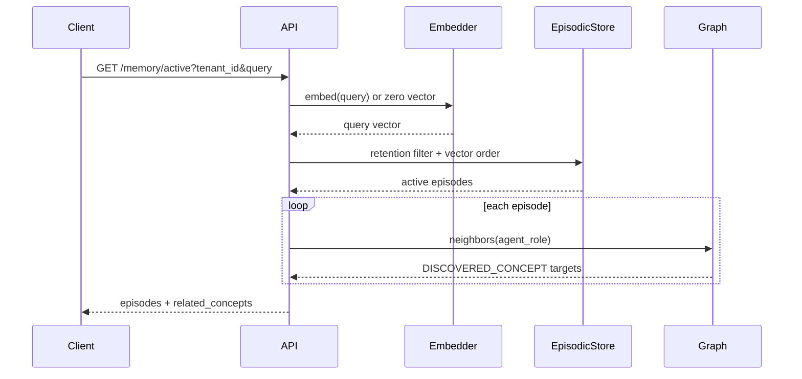

# Tiered memory system

## Purpose and separation from execution

The memory subsystem addresses retrieval quality and long-term organization. It is not part of the Saga commit protocol. A successful step does not automatically create a `MemoryNode`, and a memory write is not automatically journaled as a Saga effect.

The conceptual tiers are:

1. **episodic memory:** individual timestamped experiences with embeddings and metadata;
2. **active-memory filtering:** a retention score determines which episodes are eligible for retrieval;
3. **semantic memory:** repeated, nearby episodes are clustered and projected as concept relationships in Neo4j.

## Episodic record

`MemoryNode` and the Timescale schema represent:

| Field | Meaning |
| --- | --- |
| `memory_id` | UUID identity. |
| `tenant_id` | Isolation key in storage queries. |
| `created_at` | Encoding time. |
| `last_retrieved_at` | Recency input for decay. |
| `agent_role` | Originating agent/persona; also used as a graph source node. |
| `summary` | Human-readable episodic content. |
| `context_data` | Optional structured context in the store. |
| `importance_score` | Salience multiplier, expected by design to be in `[0,1]`. |
| `retrieval_count` | Reinforcement count. |
| `embedding` | Dense vector used for cosine similarity and clustering. |

The dataclass describes importance as `[0,1]`, but the store method itself does not enforce that range.

## Embeddings

With an OpenAI API key and client dependency, `EmbeddingService` calls the configured embedding model. Results are cached in a process-local LRU of 4,096 entries.

Without that client, it creates a deterministic unit vector from repeated SHA-256 output. This fallback is stable and useful for tests, but it is **not a semantic embedding**: linguistically similar text is not expected to be nearby. Therefore, offline fallback search and clustering validate mechanics, not real semantic quality.

## Episodic storage and vector retrieval

When TimescaleDB/PostgreSQL is available, the store creates `episodic_memories` and a pgvector HNSW cosine index. Query-time `hnsw.ef_search` is configurable. The migration also creates a Timescale hypertable, while the runtime initializer creates the table and vector index but does not call `create_hypertable`.

If the database is unavailable and `REQUIRE_BACKENDS=false`, the store uses an in-process list. This fallback is not durable or shared across workers.

Similarity retrieval orders by pgvector cosine distance (`<=>`). The active-memory endpoint uses the decay-filtered variant described below.

## Retention model

SagaMind uses a parameterized exponential score inspired by Ebbinghaus:

```text
S = S_init × (1 + gamma × ln(retrieval_count + 1)) × importance
R(t) = exp(-hours_since_last_retrieved / S)
```

Default parameters are:

- `S_init = 12` hours: base time constant, not half-life;
- `gamma = 0.45`: reinforcement strength from retrievals;
- `tau = 0.15`: active/inactive threshold.

Higher importance or retrieval count increases `S`, slowing decay. A memory is “active” if `R ≥ tau`. Negative elapsed time is clamped to zero in Python. Nonpositive strength yields zero retention.

The SQL active-memory query mirrors the equation and filters before returning results. It then orders surviving records by vector similarity.

The name `calculate_retention` uses probability-like values in `[0,1]`, but the score is a ranking/eligibility heuristic, not a calibrated probability that a person or model will remember something.

## Retrieval flow



When no query is supplied, the API uses a zero vector. Cosine distance to a zero vector is not a meaningful relevance ranking, so database ordering in that mode should not be interpreted as semantic rank.

The current read path does not increment `retrieval_count` or update `last_retrieved_at`. Thus reinforcement values must be maintained by another code path; none is exposed by the current REST API.

## Consolidation or “sleep cycle”

Consolidation fetches all episodes for one tenant and computes a pairwise cosine-distance matrix. The implementation chooses the fastest available equivalent path:

1. optional Rust/PyO3 kernel;
2. NumPy matrix operations;
3. pure-Python double loop.

It then runs a local deterministic DBSCAN implementation with default `eps=0.2` and `min_samples=2`.

DBSCAN terminology:

- **epsilon (`eps`):** maximum cosine distance for neighborhood membership;
- **core point:** a point with at least `min_samples` neighbors including itself;
- **density reachable:** reachable by chaining neighborhoods through core points;
- **noise:** a point not assigned to a dense cluster;
- **cluster:** a maximal density-connected set.

Noise is omitted. For each cluster with at least two episodes, the consolidator chooses a label:

- `Cluster N Concept` without an LLM client;
- an LLM-produced short noun phrase when a compatible `summarize(prompt)` client is injected.

It writes two kinds of graph edge per episode:

```text
(concept)-[:RELATION {type: "SUMMARIZES_EXPERIENCE", weight: 0.7}]->(summary)
(agent_role)-[:RELATION {type: "DISCOVERED_CONCEPT", weight: 0.5}]->(concept)
```

Neo4j stores a generic `RELATION` relationship whose semantic type is a property. Repeated matches update weight as `new + (1-old)×0.1`; they do not simply replace it.

## Scheduled consolidation

If APScheduler is installed and `CONSOLIDATION_CRON` contains five space-separated cron fields, the API schedules consolidation. The scheduled call currently passes tenant ID `"*"`; stores perform exact tenant equality, so this does not mean “all tenants.” Unless a literal `*` tenant exists, the scheduled cycle processes no records. Manual `/memory/consolidate?tenant_id=...` is the working tenant-specific path.

## What consolidation does not do

- It does not delete or merge source episodes.
- It does not persist a separate cluster object.
- It does not evaluate concept-label quality.
- It does not guarantee stable numeric cluster IDs when input ordering changes.
- It does not create semantic embeddings in offline mode.
- It does not currently expose graph queries as a separate public endpoint.

