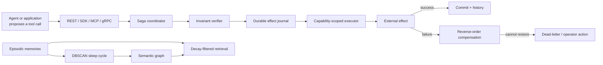

# SagaMind documentation map

This directory explains the **current implementation** of SagaMind from first principles. It is written for readers who want to understand not only the public idea, but also the exact execution path, data model, failure behavior, trust boundaries, and unfinished edges.

## The shortest accurate description

SagaMind is a research runtime for safely executing agent-proposed tool calls and retaining selected agent memories. It combines:

1. a **Saga coordinator** that executes ordered actions and runs compensating actions in reverse order after a failure;
2. a **write-ahead effect journal** that records an intended action and its inverse before the action runs;
3. **policy and proof mechanisms** that reject malformed or unsafe proposals before execution;
4. a **capability-scoped worker/WASI boundary** for tools;
5. a **tiered memory subsystem** that stores episodes, filters them with a decay score, and turns dense clusters into graph relationships.

SagaMind is not an LLM, an agent planner, or a complete autonomous-agent product. Another system proposes goals and tool calls; SagaMind validates, executes, records, compensates, retrieves, and consolidates them.

## Recommended reading order

| Document | Question it answers |
| --- | --- |
| [01 — What SagaMind is](01-what-and-why.md) | What problem does it solve, who needs it, and what is outside its scope? |
| [02 — System architecture](02-system-architecture.md) | What are the components and how do they connect? |
| [03 — Saga execution and recovery](03-saga-execution-and-recovery.md) | Exactly what happens to an action, including crashes and rollback? |
| [04 — Safety, verification, and tools](04-safety-verification-and-tools.md) | What is checked, what is proved, and what isolation means here? |
| [05 — Memory system](05-memory-system.md) | How are episodic memories scored, searched, clustered, and projected into a graph? |
| [06 — Interfaces and operations](06-interfaces-and-operations.md) | How do REST, SDK, MCP, gRPC, Temporal, configuration, and deployment work? |
| [07 — Codebase map](07-codebase-map.md) | Where does every responsibility live in the repository? |
| [08 — Guarantees and gaps](08-guarantees-and-gaps.md) | What can be relied on today, and what remains incomplete or experimental? |
| [Glossary](GLOSSARY.md) | What does every important term mean in this project? |

## Authority and evidence

The documentation uses three labels:

- **Implemented:** directly present in the current code and covered by tests or a concrete code path.
- **Optional:** implemented only when an extra dependency or external service is configured.
- **Target/design:** described in research or historical material but not part of the default runtime path.

For conflicts, the authority order is:

1. executable code and tests;
2. [the root implemented-architecture statement](../ARCHITECTURE.md);
3. this documentation set;
4. the README and research paper;
5. historical or aspirational documents such as `system_architecture.md`, `architecture_exp.md`, and `ABOUT/ABOUT.md`.

The suite passed **246 tests with 1 optional-runtime test skipped** when this guide was prepared. That validates the tested component behavior; it does not establish distributed correctness, semantic policy completeness, or real-world agent performance.

## One-page mental model

The execution and memory paths share the API process and tenant boundary, but are otherwise loosely coupled. Successful Saga steps are **not automatically written as episodic memories** by the current implementation.

